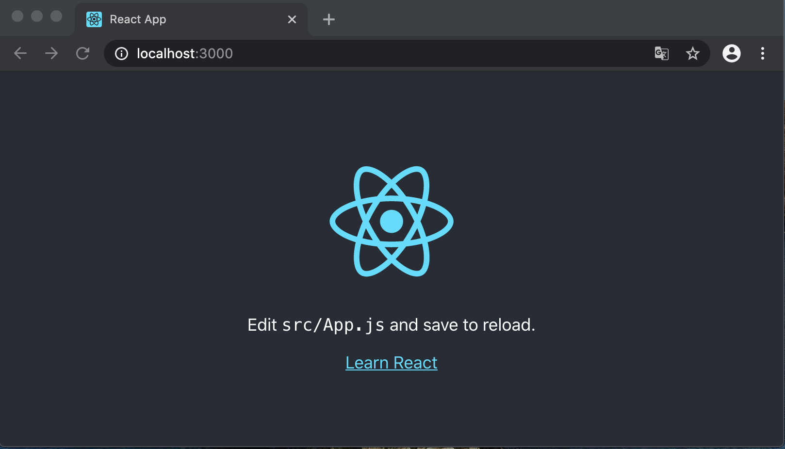

## 新建工程

```shell
# 在命令行执行npx命令使用最新版本的react脚手架来创建项目
npx create-react-app antd-in-action
```
当显示下面的内容是，恭喜你，工程创建成功了！
```shell
Success! Created antd-in-action at /Users/peter/Developer/gitrepo/antd-in-action
Inside that directory, you can run several commands:

  yarn start
    Starts the development server.

  yarn build
    Bundles the app into static files for production.

  yarn test
    Starts the test runner.

  yarn eject
    Removes this tool and copies build dependencies, configuration files
    and scripts into the app directory. If you do this, you can’t go back!

We suggest that you begin by typing:

  cd antd-in-action
  yarn start

Happy hacking!
```

## 运行工程

当脚手架安装完成后，输出了一些建议命令，接下来我们运行项目，在浏览器中打开项目的地址和端口

```shell
yarn start # 或者npm start 或者npm run start
```

当命令行输出类似下面的内容，表示工程启动成功。输出内容非常干净漂亮，如果代码中有错误和问题，会在这里刷新，请保持代码干净，控制台干净！

```shell
Compiled successfully!

You can now view antd-in-action in the browser.

  Local:            http://localhost:3000
  On Your Network:  http://192.168.0.100:3000

Note that the development build is not optimized.
To create a production build, use yarn build.
```

在浏览器中打开控制台显示的地址，浏览器显示下面的内容，至此react工程创建成功！享受开发的快乐吧！



## 添加antd依赖

依赖分为6种

1. 应用依赖 dependencies
2. 开发时依赖 devDependencies
3. 全局依赖
4. 同等依赖/同伴依赖 peerDependencies
5. 可选依赖 optionalDependencies
6. 打包依赖 bundledDependencies / bundleDependencies

严格来说package.json只有5种依赖，全局依赖是node环境中的依赖。peerDependencies、optionalDependencies、bundleDependencies一般用于插件开发，我们平常开发项目只用到了dependencies、devDependencies。

devDependencies安装的依赖只在开发时使用，build后是不会把依赖打进dist文件中，dependencies安装的依赖在运行时环境也要用到。

所以安装antd需要安装成dependencies，可以在npm和yarn中任选一种安装工具，但不要混用。

```shell
npm i antd
```

当控制台输出类似一下内容，表示依赖安装成功

```shell
+ antd@4.1.5
added 258 packages from 164 contributors, removed 123 packages and updated 1408 packages in 79.493s

59 packages are looking for funding
  run `npm fund` for details
```

这时候package.json中就会在dependencies会增加antd的依赖配置`"antd": "^4.1.5",`，具体的说明请阅读package.json说明文档。

```json
{
  "name": "antd-in-action",
  "version": "0.1.0",
  "private": true,
  "dependencies": {
    "@testing-library/jest-dom": "^4.2.4",
    "@testing-library/react": "^9.3.2",
    "@testing-library/user-event": "^7.1.2",
    "antd": "^4.1.5",
    "react": "^16.13.1",
    "react-dom": "^16.13.1",
    "react-scripts": "3.4.1"
  },
  "scripts": {
    "start": "react-scripts start",
    "build": "react-scripts build",
    "test": "react-scripts test",
    "eject": "react-scripts eject"
  },
  "eslintConfig": {
    "extends": "react-app"
  },
  "browserslist": {
    "production": [
      ">0.2%",
      "not dead",
      "not op_mini all"
    ],
    "development": [
      "last 1 chrome version",
      "last 1 firefox version",
      "last 1 safari version"
    ]
  }
}
```

在App.css的头部使用@import全局引入antd.css

```css
@import '~antd/dist/antd.css';
```


参考文档

安装antd：https://ant.design/docs/react/use-with-create-react-app-cn#header

package.json说明：https://docs.npmjs.com/files/package.json

## 开发第一个Header组件

在src目录下创建一个目录，名字叫做`components`，component是组件的意思，加-s表示复数，意思是这个目录下都是组件。

在components下心间一个目录Header，这个目录下可以放拆分的代码和组件的样式文件、组件需要的图片等。

这个目录下新建一个index.jsx表示这个组件的入口，index.jsx的内容

```jsx
import React from 'react'

export default () => {
    return <>Header</>
}
```

删除App.css中的样式代码。

修改App.js的代码，将Header引入到页面中渲染，观察页面中的变化。

```js
import React from 'react';

import MyHeader from './components/Header'
import './App.css';

function App() {
  return (
    <div className="App">
      <MyHeader />
    </div>
  );
}

export default App;

```

`import`是Javascript的模块导入语法，参考文档https://developer.mozilla.org/zh-CN/docs/Web/JavaScript/Reference/Statements/import

在node开发环境中，`import MyHeader from './components/Header'`会默认找Header目录下的index命名的文件。

React组件必须显式的在头部import React依赖，有一些框架比如next会默认帮你隐式的导入react的依赖，但是这里没有用到这些框架，所以这里必须有这一行代码。

## 开发一个首页

我们做一个跟antd官方一样的首页https://ant.design/index-cn

## 类组件和函数组件

在前文里的代码，都是使用函数组件的方式来写的组件，这也是React未来要推崇的写法，所以建议新的组件都用函数方式来编写。但是也不能不会类方式写组件，下面使用类方式来写一个组件。

## 支持Typescript

如果是第一次使用Typescript，体验将会是痛苦的，但是随着使用的程度和时间，会越来越觉得丝滑。最后又会有一些痛苦，但是最终会用得非常开心。

原因在于接触typescript的时候会有很多报错，需要一一解决，让ts和es共存。

熟练后就没有什么问题了，但是使用过程中发现很多三方库，都不支持ts，需要自己写定义文件。

但是最终熟练后，这些都不成问题了。


## react脚手架操作手册

This project was bootstrapped with [Create React App](https://github.com/facebook/create-react-app).

## Available Scripts

In the project directory, you can run:

### `yarn start`

Runs the app in the development mode.<br />
Open [http://localhost:3000](http://localhost:3000) to view it in the browser.

The page will reload if you make edits.<br />
You will also see any lint errors in the console.

### `yarn test`

Launches the test runner in the interactive watch mode.<br />
See the section about [running tests](https://facebook.github.io/create-react-app/docs/running-tests) for more information.

### `yarn build`

Builds the app for production to the `build` folder.<br />
It correctly bundles React in production mode and optimizes the build for the best performance.

The build is minified and the filenames include the hashes.<br />
Your app is ready to be deployed!

See the section about [deployment](https://facebook.github.io/create-react-app/docs/deployment) for more information.

### `yarn eject`

**Note: this is a one-way operation. Once you `eject`, you can’t go back!**

If you aren’t satisfied with the build tool and configuration choices, you can `eject` at any time. This command will remove the single build dependency from your project.

Instead, it will copy all the configuration files and the transitive dependencies (webpack, Babel, ESLint, etc) right into your project so you have full control over them. All of the commands except `eject` will still work, but they will point to the copied scripts so you can tweak them. At this point you’re on your own.

You don’t have to ever use `eject`. The curated feature set is suitable for small and middle deployments, and you shouldn’t feel obligated to use this feature. However we understand that this tool wouldn’t be useful if you couldn’t customize it when you are ready for it.

## Learn More

You can learn more in the [Create React App documentation](https://facebook.github.io/create-react-app/docs/getting-started).

To learn React, check out the [React documentation](https://reactjs.org/).

### Code Splitting

This section has moved here: https://facebook.github.io/create-react-app/docs/code-splitting

### Analyzing the Bundle Size

This section has moved here: https://facebook.github.io/create-react-app/docs/analyzing-the-bundle-size

### Making a Progressive Web App

This section has moved here: https://facebook.github.io/create-react-app/docs/making-a-progressive-web-app

### Advanced Configuration

This section has moved here: https://facebook.github.io/create-react-app/docs/advanced-configuration

### Deployment

This section has moved here: https://facebook.github.io/create-react-app/docs/deployment

### `yarn build` fails to minify

This section has moved here: https://facebook.github.io/create-react-app/docs/troubleshooting#npm-run-build-fails-to-minify
